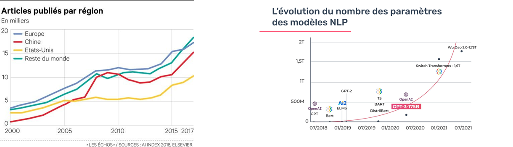
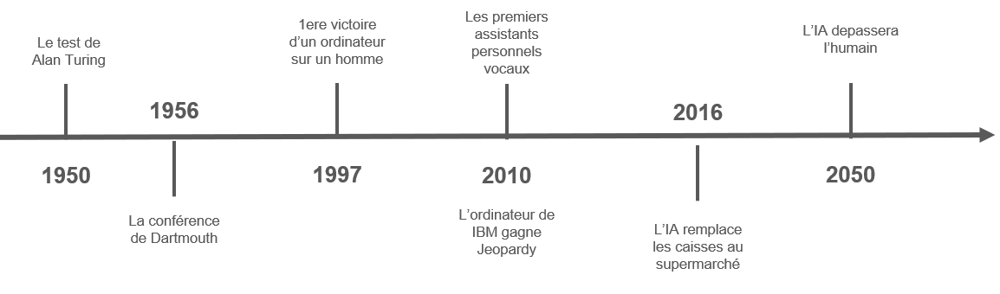
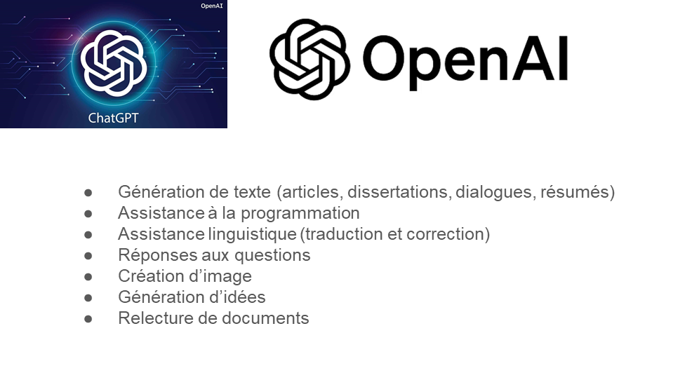

# Intelligence Artificielle

### Définition

On parle depuis très longtemps du phénomène de l’intelligence artificielle, cela désigne la capacité d'une machine ou d'un système informatique à effectuer des tâches qui nécessitent normalement l'intelligence humaine. Cela inclut des tâches telles que la reconnaissance vocale, la reconnaissance d'images, la prise de décision, la résolution de problèmes, et même l'apprentissage à partir de l'expérience. Avec le développement des nouvelles technologies, d’internet et des réseaux sociaux ces vingt dernières années, l’intelligence artificielle est devenue omniprésente dans notre monde.

Le NLP pour Natural Language Processing ou Traitement du Langage Naturel est une discipline qui porte essentiellement sur la compréhension, la manipulation et la génération du langage naturel par les machines.  Ainsi, le NLP est réellement à l’interface entre la science informatique et la linguistique. Il porte donc sur la capacité de la machine à interagir directement avec l’humain.

Taille du marché : En 2024, le marché mondial de l'IA était évalué à 279,22 milliards de dollars . Les projections indiquent une croissance continue, avec une valeur estimée à 390,91 milliards de dollars en 2025, soit un taux de croissance annuel composé (CAGR) de 35,9 % entre 2025 et 2030.
Adoption par les entreprises : En 2025, l'adoption de l'IA par les entreprises continue de progresser. En 2024, environ 83 % des entreprises considéraient l'IA comme une priorité stratégique pour les années à venir . Cette tendance se renforce en 2025, avec une intégration accrue de l'IA dans divers secteurs pour améliorer l'efficacité opérationnelle et stimuler l'innovation.​
Création d'emplois et automatisation : L'IA joue un rôle double en matière d'emploi. D'une part, elle automatise certaines tâches, ce qui peut entraîner la suppression de certains postes. D'autre part, elle favorise la création de nouveaux emplois. En 2025, on prévoit que 97 millions de personnes travailleront dans le domaine de l'IA . De plus, 64 % des entreprises estiment que l'IA contribue à accroître leur productivité globale .​

