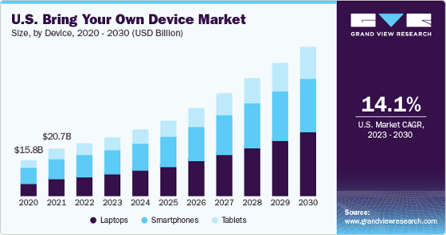
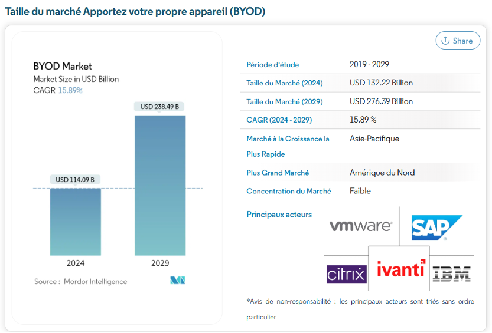

# La consommation de l'IT et le BYOD

## Contexte

**Définition​**

- La consumérisation désigne le mélange des utilisations personnelle et professionnelle des technologies, particulièrement chez les jeunes employés mobiles.​

**Exemple** ​

- Usage de WhatsApp pour des communications professionnelles, malgré son design pour usage privé.​

**Impact sur les services informatiques​**

- Les services doivent gérer des technologies personnelles tout en sécurisant les réseaux professionnels.​

**Flux inversé d’innovation​**

- Les innovations grand public s'intègrent dans les entreprises après avoir pénétré les foyers.

**LE BYOD​**

Le BYOD (Bring Your Own Device) est l'une des manifestations les plus évidentes de la consumérisation de l’informatique. ​
​
En permettant aux employés d’utiliser leurs appareils personnels (smartphones, tablettes, ordinateurs) pour accéder aux systèmes d’entreprise, le BYOD matérialise ce mélange des sphères personnelle et professionnelle

**Etude du BYOD**

Référence : [BYOD Etude](https://www.grandviewresearch.com/industry-analysis/bring-your-own-device-market)

2ème étude :

Référence : [BYOD Etude 2ème étude](https://www.mordorintelligence.com/fr/industry-reports/byod-market
)

## Enjeux

**Enjeu Technologique**

- Comment gérer la diversité des appareils personnels tout en garantissant la sécurité et la compatibilité ?​

**Enjeu Ecologique :​**

- Le BYOD permet-il de réduire l’impact environnemental des équipements numériques en entreprise ?​

**Enjeu Légal​**

- Quels sont les risques juridiques liés à la confidentialité et à la protection des données personnelles dans un cadre BYOD ?​

## Références

Context :

https://www.lemagit.fr/definition/Consumerisation-de-linformatique#:~:text=La%20consum%C3%A9risation%20de%20l'informatique,la%20consum%C3%A9risation%20de%20l'informatique.

https://www.marketsandmarkets.com/Market-Reports/enterprise-mobility-334.html
