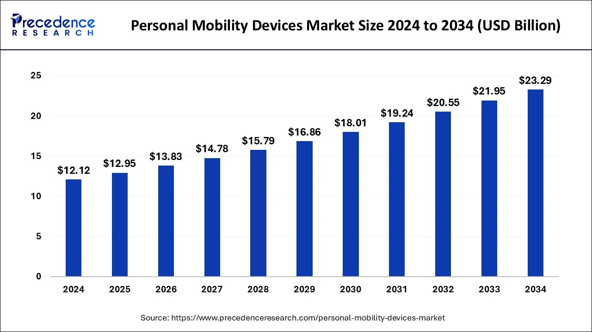

# Les outils numériques au service de la mobilité

## Contexte

**Définition​**

- Les outils numériques de mobilité englobent l’ensemble des technologies et solutions digitales qui optimisent, régulent ou transforment les déplacements des personnes et des biens. Cela comprend les applications de navigation, les plateformes de covoiturage, les outils MaaS (Mobility as a Service), les systèmes de gestion de flotte, et les capteurs IoT dans les infrastructures.

**Exemples concrets​**

- Une collectivité met en place une application qui agrège en temps réel les horaires des bus, les trottinettes en libre-service, et la disponibilité des parkings pour fluidifier la mobilité urbaine.

- Une entreprise logistique équipe ses camions de capteurs connectés et d’un logiciel de gestion de flotte pour optimiser les itinéraires en fonction du trafic et des émissions de CO₂.

**Impact sur les politiques publiques​**

- L'État et les collectivités territoriales investissent massivement dans des plans de mobilité numérique pour répondre aux enjeux environnementaux, d’accessibilité et de sécurité des transports.

- Exemple : la Loi d’Orientation des Mobilités (LOM) impose aux collectivités de proposer des services numériques d'information et de billettique multimodale (source).

**Flou juridique**

- La circulation massive de données personnelles (trajectoires, habitudes, horaires…) soulève des problématiques de conformité avec le RGPD. (Exemple : Tesla)

**Etude social**

- 54 % des travailleurs français se disent stressés par leurs trajets domicile-travail (source : OpinionWay 2023).

Source : https://www.newtonoffices.com/fr/blog/sondage-trajet-domicile-travail/#:~:text=quotidiennement%20les%20probl%C3%A8mes-,Trajet%20domicile%2Dtravail%20%3A%2054%25%20des%20Fran%C3%A7ais%20redoutent%20quotidiennement%20les,termes%20de%20trajet%20domicile%2Dtravail.

**Etude du marché**

Source : https://www.fortunebusinessinsights.com/industry-reports/mobility-devices-market-100520

## Enjeux

**Enjeu Technologique**

- Comment faire pour que les outils numériques ne deviennent pas une contrainte supplémentaire ?

**Enjeu Social**

- Comment garantir que les outils numériques améliorent réellement le quotidien des usagers et des salariés  ?

**Enjeu Économique**

- Comment concilier investissements dans des outils performants avec des objectifs de rentabilité et d’optimisation des coûts ?

**Enjeu Politique** 

- Comment les politiques publiques peuvent-elles encadrer, favoriser l'essor du numérique dans les mobilités ?

**Enjeu Légal**

- Comment garantir la conformité des outils numériques avec les lois et réglementations en vigueur ?